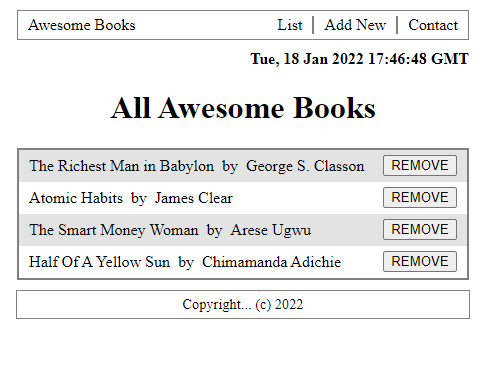

# AWESOME BOOKS
> This website GoodBooks provides users a convenient way to keep track of their books or reading lists. Users can add and remove books from the list of books they curate on the website.

## Built With

- HTML
- CSS
- JavaScript

## Clone and review it

Run the following commands to clone and run it.

#### To clone the repository

  `git@github.com:BenjaminSemah/ES6-AwesomeBooks.git`

#### To enter Directory

`cd ES6-AwesomeBooks/`

## Author

👤 **Benjamin Semah**

- GitHub: [Benjamin Semah](https://github.com/BenjaminSemah)
- Twitter: [Benjamin Semah](https://twitter.com/BenjaminSemah)
- LinkedIn: [Benjamin Semah](https://www.linkedin.com/in/benjaminsemah/)

## 🤝 Contributing
Contributions, issues, and feature requests are welcome!
Feel free to check the [issues page](https://github.com/BenjaminSemah/Awesome-Books/issues).

## Show your support
Give a ⭐️ if you like this project!

## 📝 License
This project is [MIT](./MIT.md) licensed.
